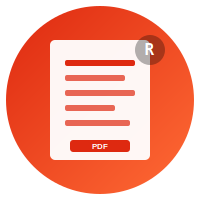

<p align="center">
  
</p>

<h1 align="center">Folio</h1>

<p align="center">
  <em>A Rust-native, Gotenberg-compatible PDF service — with a live operator console.</em>
</p>

<p align="center">
  
  
  
</p>

---

Folio converts **HTML, URLs, Markdown, and Office documents** into PDFs using
real Chrome under the hood. It speaks the same HTTP API as
[Gotenberg](https://github.com/gotenberg/gotenberg), so most existing
clients can point at Folio with only a base-URL change.

Unlike Gotenberg, Folio also runs as a **Rust library, a CLI, and a single
binary** — and ships with a live operator console at `/_/` so you can see
what your PDF service is actually doing without wiring up Grafana first.

> **Status:** active. Core conversions and PDF ops are production-ready.
> Webhook callback delivery, batch ZIP output, and a few advanced Chromium
> options are still in progress — see the [feature comparison](./comparison.md).

---

## Why Folio

- **Gotenberg-compatible.** Same routes (`/forms/chromium/*`,
  `/forms/libreoffice/convert`, `/forms/pdfengines/*`), same multipart
  contract. Drop-in for ~85% of workloads.
- **Memory-safe.** Rust core; no GC pauses, no parser-level CVEs from
  malformed inputs.
- **Four ways to run it.** HTTP server, CLI, Rust library, Docker — pick
  whichever fits your shape. The library is the source of truth; the
  server and CLI are thin wrappers.
- **Observability-first.** Prometheus metrics, OpenTelemetry traces, and
  a built-in Svelte SPA at `/_/` showing live RPS, p95 latency,
  per-engine health, concurrency, and active batches over SSE.
- **Slim deployment targets.** Multi-stage Dockerfile produces full,
  Chromium-only, LibreOffice-only, Cloud Run, and Lambda images.

For the honest comparison against Gotenberg (what's parity, what's behind,
what's ahead) read [`comparison.md`](./comparison.md).

---

## 60-second quickstart

```bash
# Run the server (Docker, full image)
docker run --rm -p 3000:3000 ghcr.io/vel/folio:latest

# Convert a URL to PDF
curl -X POST http://localhost:3000/forms/chromium/convert/url \
  -F "url=https://example.com" \
  -F "landscape=true" \
  -o out.pdf

# Open the operator console
open http://localhost:3000/_/
```

That's it. Same multipart contract for HTML, Markdown, Office, merge,
split, watermark, etc.

---

## Install

| Surface          | Command                                                       |
|------------------|---------------------------------------------------------------|
| Docker (full)    | `docker pull ghcr.io/vel/folio:latest`            |
| Docker (slim)    | `docker pull ghcr.io/vel/folio:latest-chromium`   |
| CLI (cargo)      | `cargo install --path crates/cli` → `folio --help`            |
| Server (cargo)   | `cargo run -p server -- serve --port 3000`                    |
| Library          | `folio-engine = { path = "crates/engine" }` in `Cargo.toml`   |

**Prerequisites for non-Docker installs:** Rust 1.75+, Chrome/Chromium
(auto-detected, or set `CHROME_PATH`), and optionally LibreOffice for
Office conversion.

### Embeddable bindings (v1: conversion)

| Surface | Install |
|---|---|
| Python  | `pip install folio-py` — see `bindings/python/README.md` |
| Node.js | `npm install @vel/folio` — see `bindings/node/README.md` |

Both bindings embed the Rust engine directly — no HTTP server needed.
v1 supports HTML / URL / Markdown / Office → PDF. PDF ops and screenshots ship in v2.

---

## HTTP API at a glance

All routes are `POST` and accept multipart/form-data unless noted.

### Chromium (HTML / URL / Markdown → PDF or screenshot)
```
/forms/chromium/convert/{html,url,markdown}
/forms/chromium/screenshot/{html,url,markdown}
```

### LibreOffice (100+ Office formats → PDF)
```
/forms/libreoffice/convert
```

### PDF operations
```
/forms/pdfengines/{merge,split,flatten,rotate,watermark,convert,encrypt}
/forms/pdfengines/metadata/{read,write}
/forms/pdfengines/bookmarks/{read,write}
```

### Operational
```
GET  /health                 → JSON health + per-engine status
GET  /version                → plain text
GET  /prometheus/metrics     → Prometheus text format
GET  /_/                     → operator console (SPA)
GET  /_/sse                  → Server-Sent Events stream
```

For the gap analysis vs Gotenberg, see [`comparison.md`](./comparison.md).

---

## CLI

```bash
folio convert --html  index.html         --output out.pdf
folio convert --url   https://example.com --output out.pdf
folio convert --markdown README.md       --output out.pdf
folio convert --office report.docx       --output out.pdf

folio merge   a.pdf b.pdf c.pdf --output combined.pdf
folio split   input.pdf --mode uniform --span 1 --output-dir ./pages/
folio flatten input.pdf                  --output flat.pdf
folio rotate  input.pdf --angle 90       --output rotated.pdf
folio metadata read  input.pdf
folio metadata write input.pdf '{"Title":"Q2 Review"}'
```

Shell completions: `folio completion zsh > ~/.zfunc/_folio`.

---

## Library

```rust
use engine::ChromiumEngine;

#[tokio::main]
async fn main() -> anyhow::Result<()> {
    let engine = ChromiumEngine::launch().await?;
    let pdf = engine
        .html_to_pdf("<h1>Hello</h1>", None, &Default::default(), &Default::default())
        .await?;
    std::fs::write("out.pdf", pdf)?;
    Ok(())
}
```

The engine crate has zero dependency on `axum` or `tower` — it's the same
code path the server uses, just without an HTTP layer in front.

---

## Operator console

`GET /_/` serves a Svelte SPA driven by Server-Sent Events. In one screen:

- **Ticker:** RPS, p95 latency, error %, in-flight count
- **Routes table:** per-endpoint p50 / p95 / p99, error %, load %
- **Engines:** Chromium / LibreOffice up-down + restart count
- **Concurrency grid:** active vs cap, with warn/crit thresholds
- **Throughput strip:** 30-min RPS + p95 trend with SLA overlay
- **Resources:** CPU % and memory MB
- **Batches:** progress + per-item state for active batches
- **Logs:** last 20 requests, last 10 errors

This is the cleanest lead Folio has over Gotenberg today; it's where the
last 30 commits have lived. If you've ever bolted Grafana onto Gotenberg
just to see whether it's healthy — this replaces that step.

---

## Configuration

Common flags (every flag is also `FOLIO_*` env-overridable):

```bash
folio-server serve \
  --host 0.0.0.0 --port 3000 \
  --concurrency 8 \
  --max-body-bytes 52428800 \      # 50 MiB
  --request-timeout 120s \
  --chrome /usr/bin/google-chrome --no-sandbox \
  --soffice /usr/bin/soffice \
  --log-level info --log-format json \
  --api-basic-auth-username admin --api-basic-auth-password secret \
  --otel-enabled --otel-endpoint http://localhost:4318/v1/traces
```

Run `folio-server serve --help` for the full flag reference.

**TLS is intentionally not handled in-process.** Put nginx, Caddy, or
envoy in front. Cert rotation, OCSP stapling, and ALPN are not things
Folio is positioned to do better than they do.

---

## Docker variants

Single `Dockerfile`, multiple `--target` stages — pick the smallest one
that does what you need.

| Target                       | Contains             | Use case             |
|------------------------------|----------------------|----------------------|
| `folio`                      | Chromium + LO        | Default              |
| `folio-chromium`             | Chromium             | HTML/URL/Markdown only (~30% smaller) |
| `folio-libreoffice`          | LO                   | Office docs only (~40% smaller) |
| `folio-cloudrun`             | Full + Cloud Run env | Google Cloud Run     |
| `folio-lambda`               | Full + Lambda Web Adapter | AWS Lambda      |
| `folio-{cloudrun,lambda}-{chromium,libreoffice}` | Slim + platform | Mix-and-match |

```bash
docker build --target folio-chromium -t folio:chromium .
make docker-push-all DOCKER_REGISTRY=ghcr.io/me VERSION=1.0.0
```

---

## Where things stand

A short, honest scorecard. The full version is [`comparison.md`](./comparison.md).

**Ready to use:**
HTML/URL/Markdown→PDF · Office→PDF · screenshots · merge · split · flatten ·
rotate · watermark · metadata · bookmarks · encrypt · PDF/A & PDF/UA ·
Basic Auth · Prometheus · OpenTelemetry · operator console · CLI · Rust
library · multi-target Docker.

**In progress:**
Webhook callback delivery (scaffold ready, delivery TODO) ·
batch API ZIP/merge output (endpoints + worker exist) ·
advanced Chromium wait/fail conditions (`waitForSelector`, `failOn*`) ·
long tail of LibreOffice export filters · `embed` and full `stamp` routes.

**Deliberate gaps:**
TLS in-process (use a reverse proxy) · OAuth/JWT/RBAC (use a reverse
proxy) · workflow/DAG engine on top of batch (out of scope).

**Embeddable bindings (v1 shipped):**
Python (`pip install folio-py`) · Node.js (`npm install @vel/folio`) — HTML / URL / Markdown / Office → PDF in-process.

---

## Performance

Benchmarked on a 2-CPU / 2 GB Docker cgroup, 4 concurrent clients, 60 s warm-up + 120 s timed run (3 repetitions). Both servers ran identical fixture files.

### Latency (ms) & throughput

| Workload | p50 Folio | p50 Gotenberg | p95 Folio | p95 Gotenberg | RPS Folio | RPS Gotenberg |
|---|---|---|---|---|---|---|
| HTML → PDF (small) | **195** | 302 | **250** | 489 | **19.9** | 12.3 |
| HTML → PDF (large) | **213** | 299 | **271** | 421 | **17.9** | 11.9 |
| URL → PDF | **290** | 478 | **628** | 941 | **12.3** | 7.6 |
| DOCX → PDF (LibreOffice) | **286** | 688 | **528** | 1 262 | **12.3** | 5.1 |
| PDF merge | **14** | 15 | **35** | 51 | **213.9** | 181.6 |

### Peak memory (MiB)

| Workload | Folio | Gotenberg |
|---|---|---|
| HTML → PDF (small) | 340 | **320** |
| HTML → PDF (large) | 457 | **327** |
| URL → PDF | 544 | **358** |
| DOCX → PDF (LibreOffice) | 1 306 | **402** |
| PDF merge | 1 747 | **384** |

> **Note:** URL and LibreOffice workloads show high variance (CV > 30%) across runs — treat those numbers as indicative, not definitive. Chrome PDF rendering is non-deterministic. Results are hardware-specific; run `docker compose -f docker-compose.bench.yml up -d && cargo run -p bench -- perf` to reproduce on your machine.

---

## Documentation

- [`comparison.md`](./comparison.md) — in-depth audit vs Gotenberg
- [`docs/markdown-plus.md`](./docs/markdown-plus.md) — proposed
  enhanced Markdown route (front-matter, math, mermaid, themes)

> **Note on specs.** The previous 32-file `docs/specs/` tree has been
> archived to [`docs/specs-archive-2026-05-01.zip`](./docs/specs-archive-2026-05-01.zip).
> Fresh, better-organised contributor-facing specs are being written and
> will reappear under `docs/` shortly.

---

## Development

```bash
git clone https://github.com/vel/folio.git && cd folio

cargo build --release        # build everything
cargo test                   # unit + integration (skips gracefully if Chrome missing)
make check                   # fmt + clippy + unit tests (run before PRs)
make run                     # docker-compose up, full image
make test-integration        # BDD scenarios in Docker
```

| Command                 | What it does                          |
|-------------------------|---------------------------------------|
| `make docker-build`     | Build full image                      |
| `make docker-build-all` | Build all 9 image variants            |
| `make test-unit`        | `cargo test --lib`                    |
| `make test-integration` | BDD + e2e in container                |
| `make fmt` / `make lint`| `cargo fmt` / `cargo clippy`          |

**Useful env vars:** `CHROME_PATH`, `LIBREOFFICE_PATH`, `RUST_LOG`,
`FOLIO_PORT`, `FOLIO_CONCURRENCY`, `OTEL_EXPORTER_OTLP_ENDPOINT`.

---

## Contributing

PRs welcome. Three things that make a PR easy to land:

1. `make check` passes locally.
2. Conventional Commits style (`feat:`, `fix:`, `docs:`, `chore:`).
3. One feature or fix per PR — split mixed work.

For larger changes, open an issue first so we can agree on the shape
before code.

---

## Acknowledgements

- [Gotenberg](https://github.com/gotenberg/gotenberg) — the API contract Folio implements
- [chromiumoxide](https://github.com/mattsse/chromiumoxide) — Chrome DevTools Protocol client
- [lopdf](https://github.com/J-F-Liu/lopdf) — pure-Rust PDF manipulation
- [axum](https://github.com/tokio-rs/axum) — HTTP server

## License

MIT. See [LICENSE](./LICENSE).
