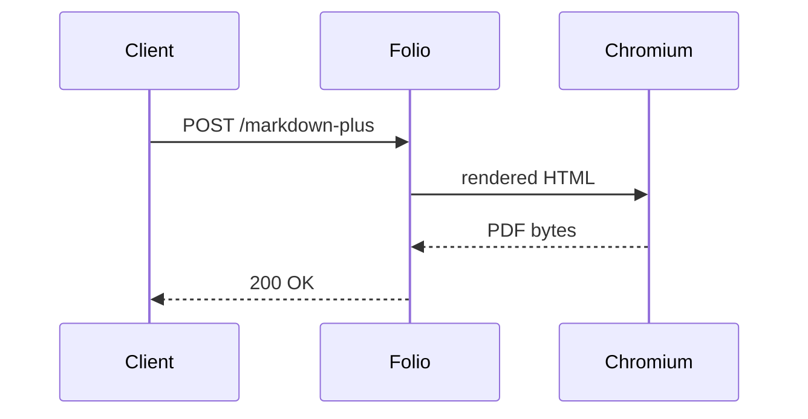

# Folio Markdown+ — A New Markdown→PDF Variation

> **Status:** Design proposal. Companion to `comparison.md` at the repo root.
> **Scope:** Defines a third Markdown rendering route for Folio that sits
> alongside the existing `/forms/chromium/convert/markdown` (basic) and the
> Gotenberg-compatible template-based path. Targets document-quality output
> (reports, dossiers, technical writing) rather than the raw GFM-in-a-box
> baseline.

---

## 1. Why a new variation?

Today Folio offers a single Markdown pipeline (`crates/engine/src/chromium/markdown.rs`):

- `pulldown_cmark` with `Options::all()` (tables, strikethrough, task lists,
  footnotes, smart punctuation).
- Wrapped in a fixed `<!DOCTYPE html>` shell with a single bundled stylesheet
  (`markdown.css`).
- Rendered through Chromium → PDF.

That covers the Gotenberg-equivalent baseline, but it falls short for the
target users implied by the operator console + observability investment:
people producing **report-grade PDFs at scale** — incident write-ups,
generated dossiers, customer-facing one-pagers, weekly digests.

Gaps observed against both the current code and Gotenberg's
`/forms/chromium/convert/markdown`:

| Need                                  | Current Folio | Gotenberg | Gap            |
|---------------------------------------|---------------|-----------|----------------|
| YAML / TOML front-matter for metadata | ❌            | ❌        | both miss      |
| Math (KaTeX / MathJax) rendering      | ❌            | ❌        | both miss      |
| Mermaid / PlantUML diagrams           | ❌            | ❌        | both miss      |
| Syntax-highlighted code               | ❌ (CSS only) | ❌        | both miss      |
| Admonitions / callouts                | ❌            | ❌        | both miss      |
| Auto table-of-contents                | ❌            | ❌        | both miss      |
| Themed templates (named styles)       | ❌            | ❌        | both miss      |
| Header/footer driven by front-matter  | ❌            | partial   | folio behind   |
| Cover page generation                 | ❌            | ❌        | both miss      |
| Cross-document includes (`@include`)  | ❌            | ❌        | both miss      |
| Asset upload + relative paths         | partial       | ✅        | folio behind   |

The "new variation" — **Markdown+** — targets the bottom half of that table
in a single coherent route. It is *not* a replacement for the basic route;
the basic route stays as the cheapest, fastest, GFM-baseline path.

---

## 2. Route design

```
POST /forms/chromium/convert/markdown-plus
```

Multipart form-data, same auth/observability stack as every other Chromium
route. Discovery via `/_/`, Prometheus, OTel traces wired identically.

### 2.1 Form fields

| Field                | Type           | Required | Purpose                                                    |
|----------------------|----------------|----------|------------------------------------------------------------|
| `index.md`           | file           | ✅       | Entry-point document                                       |
| `*.md`               | file (repeat)  | ❌       | Additional documents resolvable via `@include`             |
| `assets/**`          | files          | ❌       | Images, fonts, custom CSS resolvable by relative path      |
| `theme`              | text           | ❌       | Named theme: `default`, `report`, `book`, `slide`, `memo`  |
| `stylesheet`         | file           | ❌       | Override CSS — applied **after** the theme                 |
| `math`               | text           | ❌       | `none` \| `katex` \| `mathjax` (default: `katex` if `$`s)  |
| `diagrams`           | text           | ❌       | `none` \| `mermaid` \| `auto` (default: `auto`)            |
| `highlight`          | text           | ❌       | `none` \| `prism` \| `treesitter` (default: `prism`)       |
| `toc`                | text           | ❌       | `none` \| `auto` \| `front` \| `back` (default: `auto`)    |
| `cover`              | text           | ❌       | `none` \| `auto` (renders cover from front-matter)         |
| `frontMatterFormat`  | text           | ❌       | `yaml` \| `toml` (default: detect by fence)                |
| ... (all PDF options from basic route inherited unchanged) |

Anything in the basic route's PDF options block (paper size, margins,
landscape, header/footer HTML, scale, page ranges, cookies, headers) flows
through unchanged so Markdown+ does not become a parallel options surface.

### 2.2 Front-matter contract

A document opens with a fenced front-matter block:

```markdown
---
title: Q2 Reliability Review
author: Folio SRE
date: 2026-04-30
classification: internal
toc: true
theme: report
header: "{title} — {classification}"
footer: "Page {pageNumber} of {totalPages}"
---

# Executive summary
...
```

The renderer:

1. Strips and parses the block (`serde_yaml` / `toml`).
2. Promotes selected keys onto the PDF: `title` → `<title>`, `author` →
   `dc:creator` metadata, `date` → header substitution, etc.
3. Substitutes `{title}`, `{author}`, `{date}`, `{pageNumber}`,
   `{totalPages}`, `{url}`, `{classification}` inside header/footer HTML
   *before* it reaches Chromium.
4. Anything in front-matter beats the matching form field — front-matter is
   the document's voice; form fields are the operator's voice. (Inverse
   precedence is wrong: it would let an operator silently relabel a
   classified document.)

### 2.3 Pipeline

```
markdown bytes
   │
   ├── front-matter split  (yaml|toml)
   │
   ├── @include resolution (recursive, cycle-detected, depth-capped)
   │
   ├── pulldown-cmark      (Options::all + custom event stream)
   │       │
   │       ├── inline math   $...$   → <span class="math math-inline">
   │       ├── block math    $$...$$ → <div class="math math-display">
   │       ├── ```mermaid    → <pre class="mermaid">...</pre>
   │       ├── ```lang       → highlighted <pre><code class="lang-...">
   │       └── > [!NOTE]…    admonition → <aside class="callout note">
   │
   ├── auto-toc injection (heading walk, slugged anchors, configurable depth)
   │
   ├── theme.css + user stylesheet inlined
   │
   ├── KaTeX/Mermaid/Prism JS bundles inlined (or skipped if extension off)
   │
   └── Chromium render with extended waitFunction:
         () => window.__folioReady === true
       set after KaTeX + Mermaid finish.
```

Each stage owns one file under
`crates/engine/src/chromium/markdown_plus/`:

```
markdown_plus/
├── mod.rs          // public render() and option types
├── frontmatter.rs  // parse + extract
├── include.rs      // @include resolution
├── extensions.rs   // pulldown-cmark event-stream rewrites
├── toc.rs          // heading walk + injection
├── theme.rs        // named themes (embedded CSS)
├── assets.rs       // KaTeX / Mermaid / Prism inlining
└── ready.rs        // window.__folioReady wait protocol
```

This mirrors the existing module layout (`launch.rs`, `render.rs`,
`screenshot.rs`, `wait.rs`, `pdf_params.rs`) — no new architectural
patterns introduced.

---

## 3. Concrete syntax additions

All additions are **optional** — a plain GFM document still renders
identically to the basic route (modulo theme).

### 3.1 Math

```markdown
The continuous form is $\hat{f}(\xi) = \int f(x)\,e^{-2\pi i x\xi}\,dx$,
and the discrete equivalent:

$$
X_k = \sum_{n=0}^{N-1} x_n \cdot e^{-2\pi i k n / N}
$$
```

### 3.2 Diagrams

````markdown

````

### 3.3 Admonitions (GitHub-style)

```markdown
> [!NOTE]
> Folio does not require LibreOffice for this route.

> [!WARNING]
> Mermaid renders client-side; render times scale with diagram count.
```

Recognised tags: `NOTE`, `TIP`, `IMPORTANT`, `WARNING`, `CAUTION`. Each maps
to `<aside class="callout {tag}">` and is themed in CSS.

### 3.4 Includes

```markdown
@include shared/header.md
@include sections/methodology.md
```

Resolved relative to the multipart upload's logical root. Cycle-detected
(error returned as `400 invalid_include`); max depth 8.

### 3.5 Auto-anchors and TOC

Every heading gets a slugged `id`. `toc=auto` injects a `<nav class="toc">`
where the first explicit `<!-- toc -->` marker appears (or after the cover
page if absent and `cover=auto`).

---

## 4. Themes

Five embedded themes, each a single CSS file under
`markdown_plus/themes/`:

| Theme    | Use case                                  | Notes                          |
|----------|-------------------------------------------|--------------------------------|
| `default`| GFM-on-paper, neutral serif headings, sans body | Matches the existing `markdown.css` look so basic-route docs render identically when re-routed |
| `report` | Quarterly reviews, post-mortems           | Letter-spaced caps headings, classification banner, page-numbered footer |
| `book`   | Long-form, multi-chapter                  | Drop-caps, running headers from front-matter `chapter:` |
| `slide`  | One-section-per-page                      | `page-break-after: always` on `<h1>`; large body text |
| `memo`   | One-pagers, exec summaries                | Tight margins, no cover, single-column |

A user-supplied `stylesheet` is appended *after* the theme, so themes are
override-friendly without forcing the user to start from zero.

---

## 5. Operability

Markdown+ is louder than the basic route, so it earns its own observability
labels. No new metric *types* — just additional label values on the
existing histograms and counters:

- `folio_conversions_total{engine="chromium",endpoint="markdown_plus", ...}`
- `folio_conversion_duration_seconds{...,endpoint="markdown_plus"}`
- New histogram `folio_markdown_plus_stage_duration_seconds{stage}` with
  stages: `frontmatter`, `include`, `parse`, `toc`, `theme`, `assets`,
  `chromium`. This is genuinely new information — KaTeX or Mermaid blow-ups
  are otherwise invisible inside the chromium total.
- The operator console grows a Markdown+ panel only if any `markdown_plus`
  conversion has been observed in the last hour (avoid empty UI noise).

OTel: a single span per request named `markdown_plus.render`, with one
child span per stage. Wires through the existing tracing layer — no new
crate.

---

## 6. What this variation deliberately does *not* do

- **No HTML sanitisation regression.** Raw `<script>` is dropped at the
  parser level (Folio's basic route inlines it but Chrome refuses to run
  it; Markdown+ tightens this — `<script>` becomes a comment, no
  exceptions).
- **No template engine.** Front-matter substitution is `{key}` only; no
  Mustache/Handlebars/Liquid. People who want full templating compose two
  passes: render a Liquid template themselves, then POST to Folio.
- **No multi-file output.** One Markdown+ request → one PDF. Bulk
  rendering belongs in the (separate) batch API.
- **No cross-request state.** Includes resolve from the upload only — never
  from a server-side library. Templating-by-stealth is an exfiltration
  vector and Folio is opinionated against it.

---

## 7. Migration & compatibility

- Basic `/forms/chromium/convert/markdown` is **untouched**. Existing
  Gotenberg-compatible callers see no change.
- Markdown+ ships behind a config flag `--enable-markdown-plus` (default
  on) so locked-down deployments can disable it without touching the
  binary.
- The existing `markdown.rs` is renamed `markdown_basic.rs` only if no
  external code imports it; otherwise it stays put and Markdown+ lives
  beside it. (Non-breaking is the priority.)

---

## 8. Implementation checklist

1. New module skeleton under `crates/engine/src/chromium/markdown_plus/`.
2. Front-matter parser + tests (YAML, TOML, missing block, malformed).
3. `@include` resolver with cycle + depth limits + tests.
4. pulldown-cmark event-stream extensions (math, mermaid, admonitions).
5. TOC walker + injector.
6. Theme bundle + asset inliner (KaTeX, Prism, Mermaid as opt-in features).
7. `window.__folioReady` ready-protocol; extend `wait.rs`.
8. New route in `crates/server/src/routes/chromium.rs`.
9. Stage-duration histogram in `metrics.rs`.
10. Operator console panel (Svelte component, gated on observed traffic).
11. BDD scenarios mirroring the basic route's coverage plus math, mermaid,
    admonitions, includes, themes.
12. Docs page under (archived spec).

This is a tractable, ~2-week single-engineer slice. It does not depend on
the webhook or batch work-in-progress, so it can ship in parallel.
